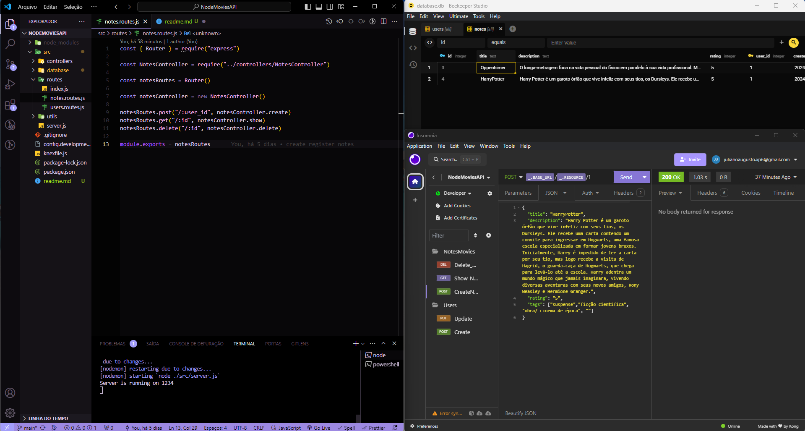

<h1 align="center"> NodeMovies🎬 </h1>

O NodeMovies🎬 foi uma aplicação proposta pela RocketSeat no programa de formação WEB EXPLORER e desenvolvida por mim, Juliano Mariano.  

  <a href="#-tecnologias">Tecnologias</a>&nbsp;&nbsp;&nbsp;|&nbsp;&nbsp;&nbsp;
  <a href="#-projeto">Projeto</a>&nbsp;&nbsp;&nbsp;|&nbsp;&nbsp;&nbsp;
  <a href="#-layout">Layout</a>&nbsp;&nbsp;&nbsp;|&nbsp;&nbsp;&nbsp;
  <a href="#-Contato">Contato</a>

 

  

## 🚀 Tecnologias

Esse projeto foi desenvolvido com as seguintes tecnologias:

- Javascript;
- Git e Github;
- SQlite;
- package.json;
- NodeJs;
- Node Modules;
- Figma;
- Insomnia;
- Beekeper Studio.

## 💻 Projeto
O NodeMovies🎬 é uma aplicação que oferece a integração entre banco de dados relacional que possibilita a criação/  de vários usuários, com criptografia de senha e middleware com tratamento de exceções. O usuário poderá criar várias notas com seus filmes preferidos, contendo o título, a nota e as categorias de cada filme. O usuário também poderá atribuir esse filme a um usuário distinto e excluir esse filme da sua lista futuramente.
Sobre o tratamento de exceções, a aplicação não permitirá que o usuário possua 2 emails igual bem como no ato da atualização de senha, ele insira a senha anterior corretamente.

## 🔖 Layout

Você pode visualizar o layout do projeto através [DESSE LINK](https://efficient-sloth-d85.notion.site/Aplica-o-em-Node-57bd49ae77b3422fad74f8dde0d06fef). É necessário ter conta no [Figma](https://figma.com) para acessá-lo.

## 🌐 Contato

LinkedIn: Juliano Mariano
 -  https://www.linkedin.com/in/juliano-marianodev/